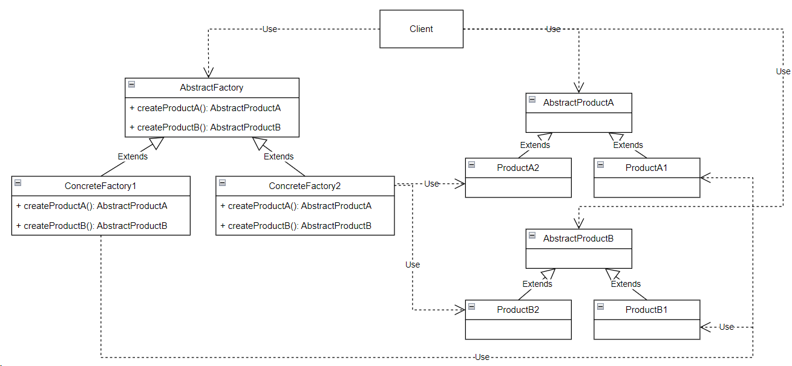

## Abstract factory (абстрактная фабрика)

**Тип:** *Порождающий паттерн*

**Краткое описание:**
Паттерн "Абстрактная фабрика" предоставляет интерфейс для создания семейств взаимосвязанных объектов,
не специфицируя их конкретных классов.

Паттерн применим в случаях:
* когда система не должна зависеть от того, как создаются, компонуются входящие в нее объекты;
* когда необходимо создать семество взаимосвязанных объектов исключая
возможность одновременного использования объектов из разных семейств в одном контексте;

