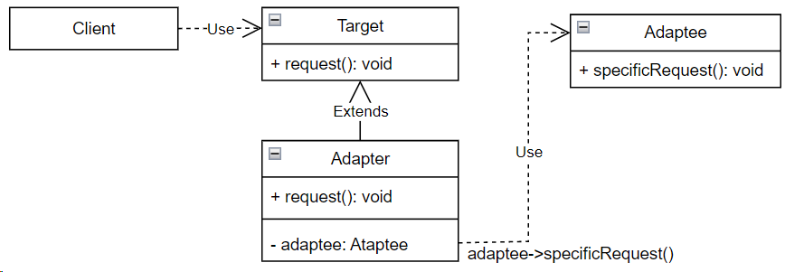

## Adapter (адаптер)

**Тип:** *Структурный паттерн*

**Краткое описание:**

Паттерн "Адаптер" позволяет обеспечить совместную работу классов с несовместимыми интерфейсами,
преобразуя интерфейс одного класса в интерфейс другого класса.

Есть 2 типа адаптеров: адаптер класса и адаптер объекта.

**Общая схема адаптера класса:**

Адаптер класса использует множественное наследование для адаптации одного интерфейса к другому.

**Общая схема адаптера объекта:**

Адаптер объекта применяет композицию объектов.

