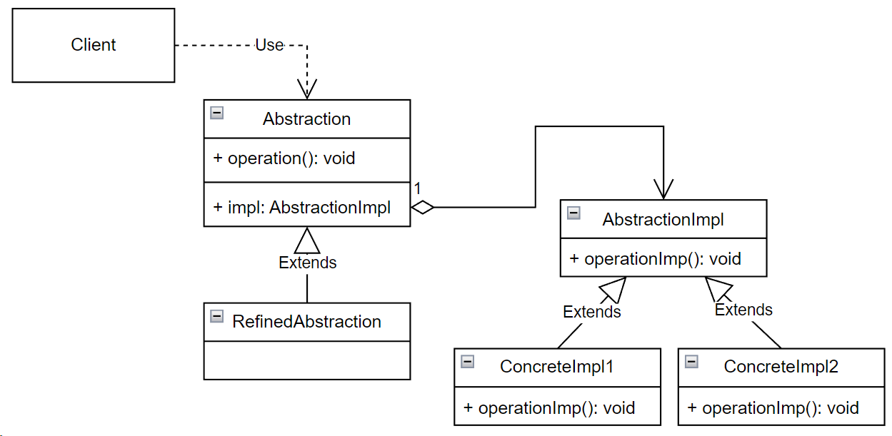

## Bridge (мост)

**Тип:** *Структурный паттерн*

**Краткое описание:**
Паттерн "Мост" позволяет отделить абстракцию, с которой взаимодействует клиент, от ее реализации так,
чтобы то и другое можно было изменять независимо.

Паттерн применим в случаях когда:
* требуется избежать постоянной привязки абстракции к реализации (например, реализация должна выбираться 
во время выполнения программы);
* предполагается, что и абстракция и реализация могут расширяться новыми подклассами;
* изменения в реализации не должны влиять на клиента (клиентский код не должен перекомпилироваться);
* реализация должна использоваться несколькими объектами.

Как правило интерфейс реализации содержит простейшие методы, в то время как интерфейс абстракции методы
более высокого уровня, реализация которых на самом деле является суперпозицией простейших методов
из интерфейса реализации.

**Общая схема:**

