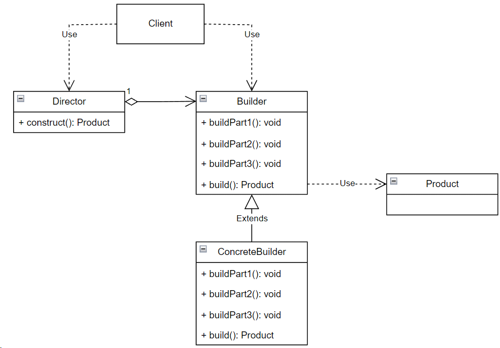

## Builder (строитель)

**Тип:** *Порождающий паттерн*

**Краткое описание:** 

Паттерн "Строитель" позволяет отделить логику конструирования сложного объекта от его представления.
Помогает выстроить иерархию классов таким образом, чтобы в результате одних и тех же шагов конструирования
(заданных в базовом классе Строителя) могли получаться различные варианты представлений (за счет использования
разных реализаций класса Строителя).

**Общая схема:**

*Builder* - строитель, задает абстрактный интерфейс для создания частей объекта Product.

*ConcreteBuilder* - конкретный строитель, определяет конкретное представление, и выполняет его наполнение
посредством реализации интерфейса Builder.

*Director* - распорядитель, конструирует объект пользуясь интерфейсом Builder.

*Product* - получаемый на выходе продукт.