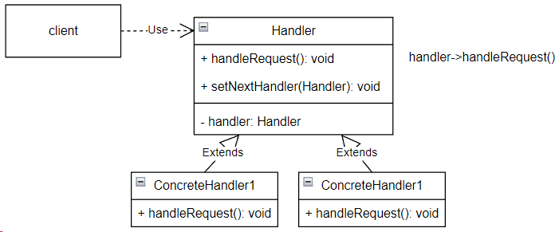

## Chain of Responsibility (цепочка обязанностей)

**Тип:** *Поведенческий паттерн*

**Краткое описание:**

Паттерн "Цепочка обязанностей" отделяет отправителя запроса от получателя, позволяет обработать
запрос нескольким объектам. Паттерн связывает объекты-получатели в цепочку и передает запрос по этой цепочке,
пока он не будет обработан, либо пока не будет достигнут конец цепочки.

Критерии применения паттерна:

- запрос может/должен быть обработан более чем одним объектом.
- запрос должен быть отправлен одному из нескольких объектов, при этом настоящий обработчик зараннее неизвестен.
- набор объектов для обработки запроса должен задаваться динамически.

Паттерн не гарантирует обработку запроса. У запроса нет явного получателя, поэтому и нет гарантий, что он
действительно будет обработан. Запрос может дойти до конца цепочки и исчезнуть.

**Общая схема:**

