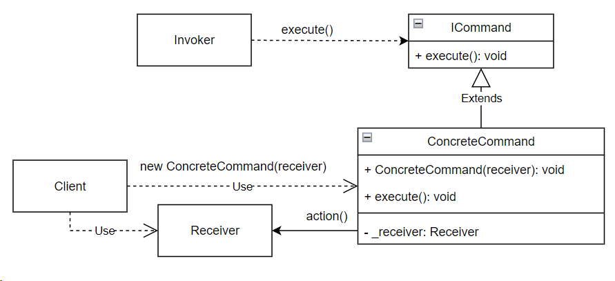

## Command (команда)

**Тип:** *Поведенческий паттерн*

**Краткое описание:**
Паттерн "Команда" (Command) позволяет инкапсулировать запрос на выполнение определенного действия 
в виде отдельного объекта. Этот объект запроса на действие и называется командой. 
При этом объекты, инициирующие запросы на выполнение действия, отделяются от объектов, 
которые выполняют это действие.

Из простых команд можно собирать составные.

При необходимости для команды можно реализовать функциональность отмены.

**Общая схема:**

