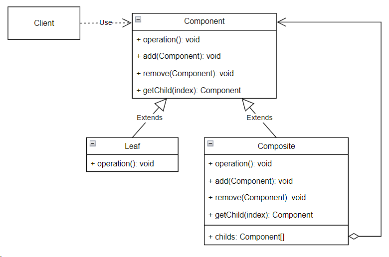

## Composite (компоновщик)

**Тип:** *Структурный паттерн*

**Краткое описание:** 
Паттерн "Компоновщик" компонует объекты в древовидные структуры. Позволяет клиентам единообразно работать
с индивидуальными и составными объектами.

Данный паттерн уместно применять, когда:
* требуется представить иерархию объектов вида "часть - целое"
* требуется работать по единым правилам с индивидуальными и составными объектами.

**Общая схема:**

