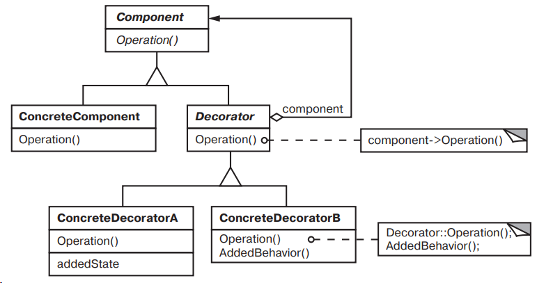

## Decorator (декоратор)

**Тип:** *Структурный паттерн*

**Краткое описание:** 
Паттерн "Декоратор" добавляет дополнительные обязанности для отдельных экземпляров класса.
Декоратор реализует интерфейс декорируемого объекта. Декоратор переадресует запросы декорируемому объекту,
выполняя при этом некоторые дополнительные действия (экземпляр декорируемого объекта можно передать 
в класс-декоратор через конструктор). Посколько декораторы реализуют интерфейс декорируемого объекта, они
могут вкладывать друг в друга, добавляя тем самым различные новые обязанности.

**Общая схема:**
