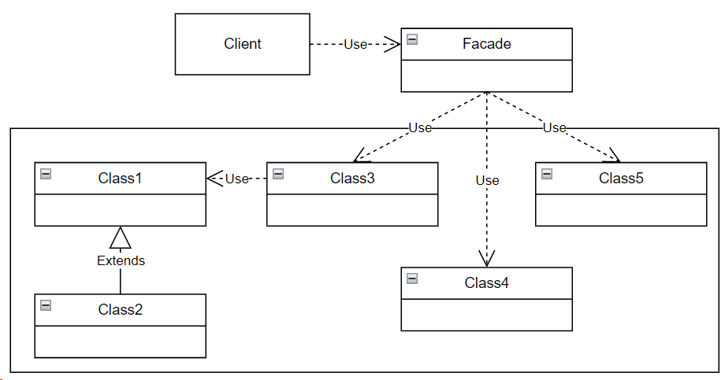

## Facade (фасад)

**Тип:** *Структурный паттерн*

**Краткое описание:**

Паттерн "Фасад" предоставляет интерфейс более высокого уровня для упрощения управления
некоторой сложной иерархией классов. Позволяет отделить подсистему классов от клиента и от других подсистем, 
тем самым способствуя уменьшению уровня связанности.

**Общая схема:**

