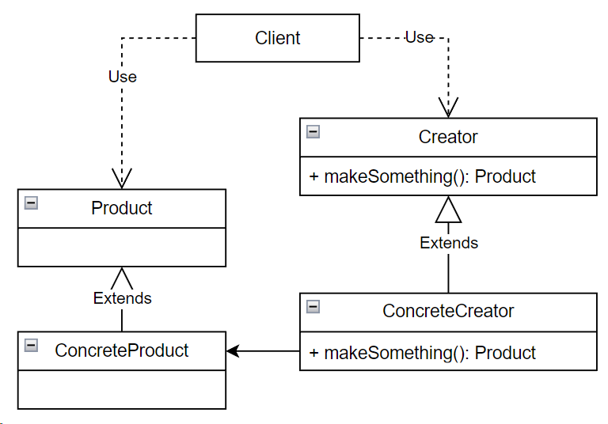

## Factory method (фабричный метод)

**Тип:** *Порождающий паттерн*

**Краткое описание:**

Паттерн "Фабричный метод" определяет интерфейс для создания объекта, позволяя своим подклассам
определять, экземпляры какого класса должны создаваться. Позволяет делегировать создание экземпляров подклассам.

**Общая схема:**

