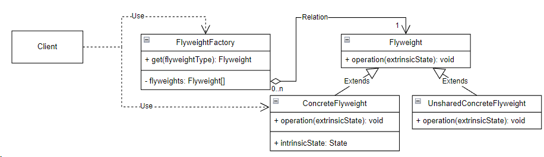

## Flyweight (приспособленец)

**Тип:** *Структурный паттерн*

**Краткое описание:**

Паттерн "Приспособленец" позволяет задействовать/использовать один экземпляр объекта в нескольких контекстах
совместно/одновременно. В каждом контексте такой экземпляр выглядит как независимый объект, то есть
неотличим от экземпляра, который не используется совместно.

В большинстве сценариев данный паттерн используется для уменьшения затрат памяти путем уменьшения
количества создаваемых объектов.

Класс приспособленец должен иметь четко различимые *внешнее* и *внутреннее* состояния. Клиент ответственнен
за передачу внешнего состояния приспособленцу, когда в этом есть необходимость.

- внутреннее состояние хранится в самом приспособленце и не зависит от контекста, поэтому может
использоваться совместно.
- внешнее состояние зависит от контекста и изменяется вместе с ним, поэтому не может использоваться
совместно.

Условия применения паттерна:

- используется большое число объектов, из-за чего высоки затраты на хранения
- большую часть состояния объектов можно вынести вовне
- многие группы объектов можно заменить относительно небольшим количеством совместно используемых
объектов, поскольку внешнее состояние вынесено
- приложение не зависит от идентичности объектов. Поскольку объекты будут использоваться совместно,
то проверка на идентичность будет успешной для концептуально различных объектов.

**Общая схема:**

