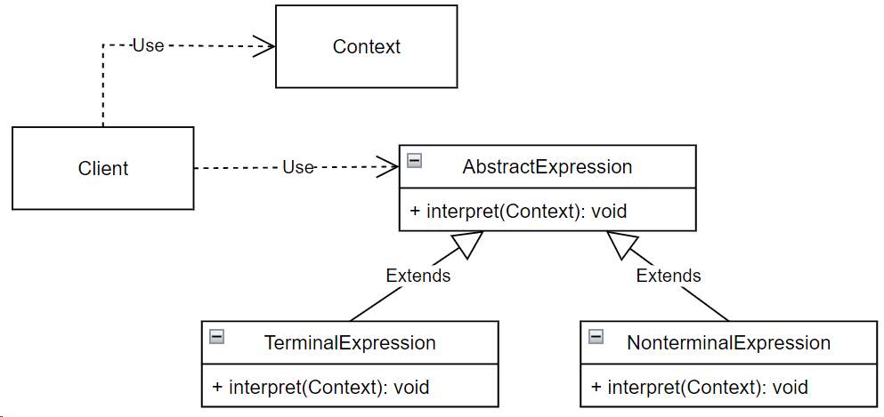

## Interpreter (интерпретатор)

**Тип:** *Поведенческий паттерн*

**Краткое описание:**

Паттерн "Интерпретатор" позволяет определить представление грамматики для заданного языка.

Если некоторая задача встречается достаточно часто, то имеет смысл представить ее конкретные
проявления в виде предложений на простом языке. После этого можно реализовать интерпретатор,
который решает задачу, анализируя предложения этого языка.

Паттерн интерпретатор применим в случаях:

- когда имеется интерпетируемый язык, конструкции которого можно представить в виде абстрактных
синтаксических деревьев.
- грамматика достаточно проста. Для сложных грамматик иерархия классов становится слишком
громоздкой и неуправляемой.
- эффективность не является главным критерием.

**Общая схема:**

**AbstractExpression** - абстрактное выражение. Объявляет абстрактную операцию interpret, общую для всех узлов в 
абстрактном синтаксическом дереве.

**TerminalExpression** - терминальное выражение. Реализует операцию interpret для терминальных символов
грамматики. Необходим отдельный экземпляр для каждого терминального символа.

**NonterminalExpression** - нетерминальное выражение. Реализует операцию interpret для нетерминальных символов
грамматики. Рекурсивно вызывает interpret для вложенных выражений.

**Context** - содержит информацию, глобальную по отношению к интерпретатору.

**Client** - строит абстрактное синтаксическое дерево, представляющее предложение на языке с данной грамматикой.
Дерево строится из экземпляров классов TerminalExpression и NonterminalExpression. После чего вызывает операцию
interpret для получения результата.

> Формальный язык — это математическая модель реального языка.

> Грамматика - способ задания языка.

>  Абстрактное синтаксическое дерево —  конечное ориентированное дерево, в котором внутренние вершины 
> сопоставлены с операторами языка, а листья — с соответствующими операндами (переменные и константы).

> Терминальные символы — это минимальные элементы грамматики, не имеющие собственной грамматической структуры

> Нетерминальные символы — это элементы грамматики, имеющие собственные имена и структуру. Каждый нетерминальный символ 
> состоит из одного или более терминальных и/или нетерминальных символов, сочетание которых определяется правилами грамматики.
