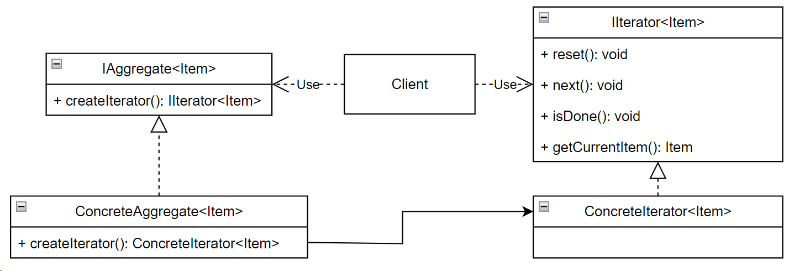

## Iterator (итератор)

**Тип:** *Поведенческий паттерн*

**Краткое описание:**
Паттерн "Итератор" предоставляет способ последовательного обращения ко всем элементам составного объекта
без раскрытия его внутреннего представления

Когда использовать паттерн?

- Когда необходимо осуществить обход объекта без раскрытия его внутренней структуры.
- Когда имеется набор составных объектов, и необходимо обеспечить единый интерфейс
для их перебора.
- Когда необходимо иметь несколько альтернативных стратегий перебора одного и того же объекта.
- Когда необходимо, чтобы в один и тот же момент действовало несколько активных
обходов одного и того же объекта.
- Когда необходимо обеспечить единообразный интерфейс для обхода различных
аггегированных структур (поддержка полиморфной итерации).

**Общая схема:**

**Типы итераторов:**

- *Внешний* - итератором управляет клиент. Клиент должен явно запросить у итератора следующий элемент.
- *Внутренний* - клиент передает итератору некоторую операцию, а итератор применяет ее для каждого элемента
посещенного в процессе обхода.

**Устойчивость итератора**

*Устройчивый итератор* гарантирует, что ни вставки, ни удаления дополнительных элементов в объект не помешают обходу.
Причем достигается это без копирования итерируемого объекта.

Вариант реализации устойчивого итератора может быть следующим: итератор регистрируется в итерируемом объекте. 
Далее, при вставки или удалении элементов, итерируемый объект корректирует внутреннее состояние всех созданных им
итераторов.