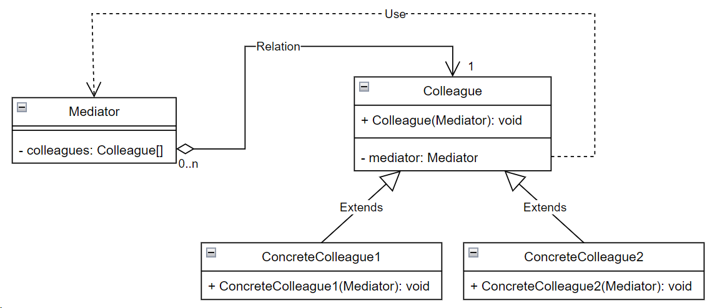

## Mediator (посредник)

**Тип:** *Поведенческий паттерн*

**Краткое описание:**

Паттерн "Посредник" обеспечивает слабую связанность системы, избавляя объекты от необходимости явно
ссылаться друг на друга и позволяя тем самым независимо изменять взаимодействия между ними. При использовании
паттерна упрощаются протоколы взаимодействия объектов, взаимодействие "все со всеми" заменяется
взаимодействиями "один со всеми".

Паттерн применим в случаях:

- когда имеется множество взаимосвязанных объектов, связи между которыми сложны и четко определены.
Получающиеся при этом зависимости трудны для понимания.
- когда повторное использование объекта затруднено, посколько он обменивается информацией
со всеми другими объектами.

**Общая схема:**

