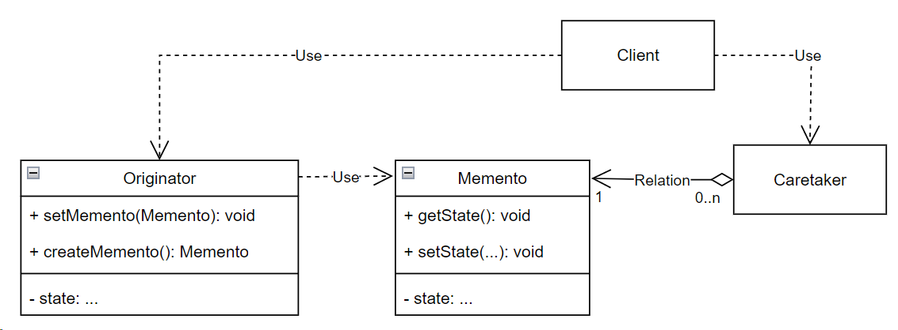

## Memento (хранитель)

**Тип:** *Поведенческий паттерн*

**Краткое описание:**

Паттерн "Хранитель" не нарушая инкапсуляции, фиксирует и выносит за пределы объекта его внутреннее состояние,
так чтобы позднее можно было восстановить в нем объект.

Паттерн позволяет избежать раскрытия информации, которой должен распоряжаться только объект-хозяин, 
но которую тем не менее необходимо хранить вне последнего за счет определения "узкого" и "широкого"
интерфейсов. Узкий интерфейс доступен внешнему коду, широкий, только объекту-хозяину.

Следует учитывать, что состояние объекта-хозяина может занимать много памяти, следовательно создание
большого числа хранителей может привести к повышенному потреблению памяти. Для решения данной проблемы
можно попробовать сохранять инкрементные изменения, но в этом случае важно, чтобы последовательность
создания хранителей была четко определена, и внешний код, управляющий состояниями учитывал эту последовательность.

**Общая схема:**

**Memento** - хранитель, сохраняет внутреннее состояние объекта Originator.

**Originator** - хозяин, создает хранитель, содержащий снимок текущего внутреннего состояния. При необходимости
может восстановить состояние из объекта хранителя.

**Caretaker** - отвечает за сохранение хранителя.