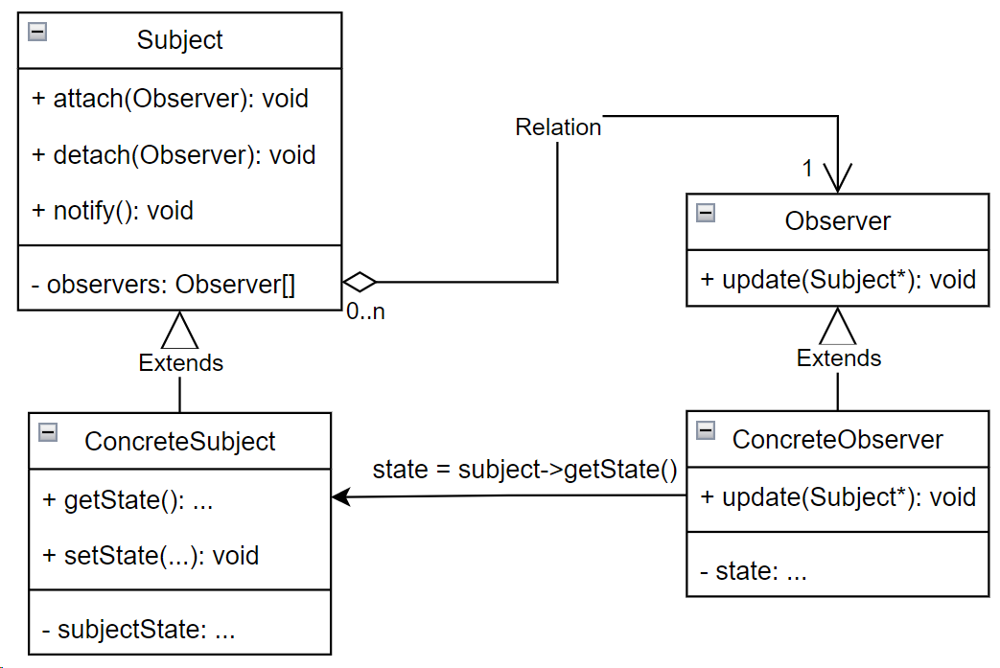

## Observer (наблюдатель)

**Тип:** *Поведенческий паттерн*

**Краткое описание:**

Паттерн "Наблюдатель" определяет зависимость типа "один ко многим" между объектами таким образом, что
при изменении состояния одного объекта все зависящие от него оповещаются об этом и автоматически обновляются.

Классы, на события которых другие классы подписываются, называются *"субъектами"* (Subject), а подписывающиеся классы
называются *"наблюдателями"* (Observer).

**Общая схема:**

Модели обновления:

**Модель проталкивания** (push model) - субъект посылает наблюдателям детальную информацию об изменении независимо
от того, нужно ли им это. Данная модель предполагает, что субъект владеет некоторой информацией о потребностях
наблюдателей. Данная модель снижает степень повторного использования.

**Модель вытягивания** (pull model) - субъект не посылает ничего, кроме минимального уведомления, а наблюдатели
запрашивают детали позднее. Модель может оказаться неэффективной, так как наблюдателям самим придется
выяснить, что изменилось.

Эффективность обновления можно повысить, расширив интерфейс регистрации, то есть при регистрации наблюдатель сможет
указать события какого типа ему интересны.

Если отношения зависимости между Subject и Observer становятся слишком сложными, например, если некоторая операция
влечет за собой изменения в нескольких независимых субъектах и хотелось бы, чтобы наблюдатели уведомлялись только
после того, как будут модифицированы все субъекты. В этом случае отношения между субъектами и наблюдателями
можно инкапсулировать в некий отдельный класс-посредник ChangeManager.

Этот класс будет иметь следующие обязанности:

- строить отображение между субъектом и его наблюдателями.
- определять конкретную стратегию обновления.
- обновлять всех зависимых наблюдателей по запросу от субъекта.