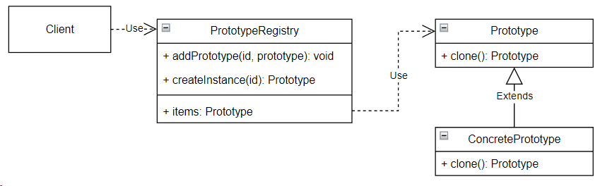

## Prototype (прототип)

**Тип:** *Порождающий паттерн*

**Краткое описание:**

Паттерн "Прототип" позволяет копировать объекты, не вдаваясь в подробности их реализации.

Проблемы, которые могут возникнуть при копировании объектов без использования паттерна (через конструктор):
1. Объект мог быть инициализирован каким-то специфическим образом. Повторять все шаги
такой инициализации труднозатратно.
2. Часть полей класса скорее всего окажется приватной, таким образом нельзя получить доступ к этим
полям не нарушая инкапсуляции.
2. Код, который выполняет копирование, окажется зависимым от классов копируемых объектов.

Паттерн "Прототип" поручает создание копий самим копируемым объектам. Для всех объектов, поддерживающих
клонирование вводится единый интерфейс. Обычно он имеет лишь один метод clone(). Данный метод создает
новый объект текущего класса и копирует в него значения своих полей, в том числе и приватных.
Если у класса имеется базовый класс, то эстафета по копированию полей передается ему.

Для более удобного взаимодействия с прототипами можно завести хранилище прототипов, в котором будут
хранится наиболее используемые прототипы.

**Общая схема:**

