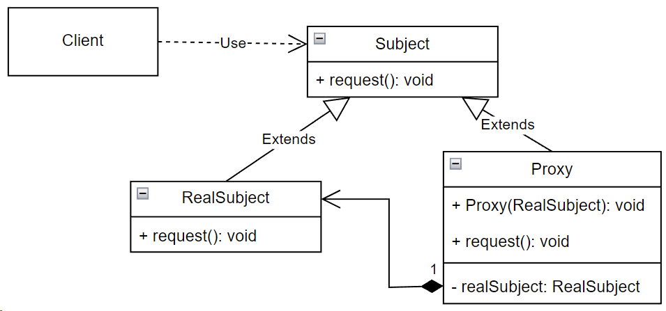

## Proxy (заместитель)

**Тип:** *Структурный паттерн*

**Краткое описание:**
Паттерн "Заместитель" предоставляет объект-заместитель, который управляет доступом к другому объекту.
Зачастую заместитель повторяет интерфейс (либо является подмножеством интерфейса) того объекта, которым он управляет.

Ситуации, когда паттерн "Заместитель" может оказаться полезным:

- удаленный заместитель (remote proxies) - предоставляет локального представителя для объекта, находящегося в другом
адресном пространстве.
- виртуальный заместитель (virtual proxies) - управление доступом к ресурсу, создание которого требует больших затрат.
Реальный объект создается только тогда, когда он действительно понадобится.
- защищающий заместитель (protection proxies) - контролирует доступ к объекту. Позволяет разграничить доступ в
зависимости от прав вызывающего объекта.
- умные ссылки (smart reference) - подсчет числа ссылок на реальный объект, автоматический контроль памяти
- установка блокировки на реальный объект при обращении к нему. Обеспечение потокобезопасной работы с объектом.

**Общая схема:**

