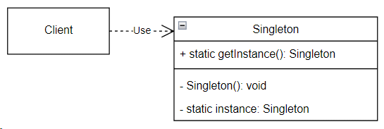

## Singleton (одиночка)

**Тип:** *Порождающий паттерн*

**Краткое описание:**

Паттерн "Одиночка" гарантирует, что у класса существует только один экземпляр, и предоставляет к нему
глобальную точку доступа.

Этот единственный экземпляр должен расширяться путем порождени подклассов, а клиенты должны иметь возможность работать
с расширенным экземпляром без модификации своего кода.

**Общая схема:**

