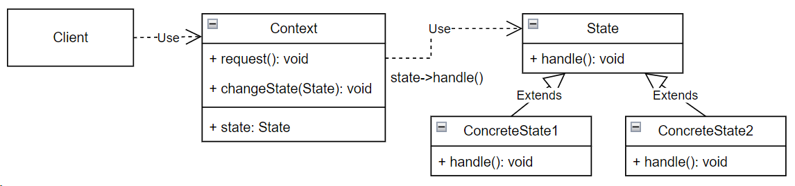

## State (состояние)

**Тип:** *Поведенческий паттерн*

**Краткое описание:**

Паттерн "Состояние" позволяет объекту изменять свое поведение в зависимости от внутреннего состояния.
Извне создается впечатление, что изменился класс объекта.

Условия применимости паттерна:

- Поведение объекта зависит от его состояния и должно изменяться во время выполнения
- В коде операций встречаются состоящие из многих ветвей условные операторы, в которых выбор ветви зависит 
от текущего состояния.

**Общая схема:**

Переходы между состояниями лучше доверить подклассам класса State. Для этого в класс Context надо добавить метод,
позволяющий объектам State установить состояние Context-а. Недостатком подобного подхода является то, что
каждый подкласс State должен знать еще хотя бы об одном подклассе, что вносит дополнительные зависимости.

Существует два варианта создания и уничтожения объектов состояния:

- создание объектов состояний, когда в них возникает необходимость, и уничтожение сразу после использования.
Данный вариант предпочтителен в тех случаях, когда возможные состояния системы неизвестны заранее, а контекст
меняет состояние сравнительно редко.
- создание их зараннее и хранение ссылок в объекте контекста. Данный подход предпочтителен, если изменение состояний
происходит достаточно часто, и уничтожать объекты было бы нежелательно.