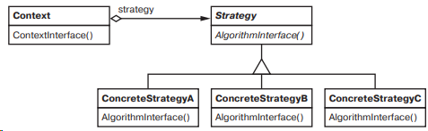

## Strategy (стратегия)

**Тип:** *Поведенческий паттерн*

**Краткое описание:** 
Паттерн "Стратегия" объединяет набор алгоритмов в семейство, инкапсулирует каждый из них и делает
их взаимозаменяемыми, позволяет изменять алгоритмы независимо от клиентов, которые ими пользуются.

**Общая схема:**

**Варианты реализации:**

- **Реализация через определение интерфейсов классов *Strategy* и *Context***. 
Интерфейсы должны предоставить объекту класса ConcreteStrategy доступ к данным контекста. 
  - Контекст может передавать необходимые данные в качестве параметров методов класса Strategy. 
    - [+] Меньшая связность классов Context и Strategy. 
    - [-] Контекст может передавать данные, которые стратегии не нужны. 
  - Передать контекст в качестве аргумента или сохранить указатель на контекст в стратегии.
    - [+] Стратегия может запрашивать только ту информацию, которая реально необходима.
    - [-] В контексте должен быть определен более развитый интерфейс доступа к данным, что усиливает связанность классов Context и Strategy.
- **Передача стратегии как параметра шаблона**.
    - [+] Не нужен абстрактный класс для определения интерфейса Strategy.
    - [+] Передача стратегии в качестве параметра шаблона позволяет статически связать стратегию с контекстом, что повышает быстродействие;
    - [-] Стратегия определяется на этапе компиляции и ее нельзя менять во время выполнения.