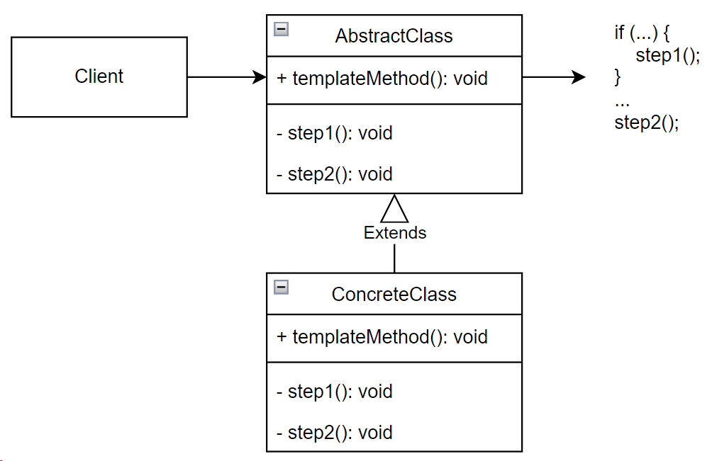

## Template Method (шаблонный метод)

**Тип:** *Поведенческий паттерн*

**Краткое описание:**

Паттерн "Шаблонный метод" определяет основные шаги некоторого алгоритма и позволяет подклассам
переопределять некоторые шаги, не изменяя структуру в целом.

Паттерн применим в случаях:

- когда некоторый алгоритм действий можно разделить на конкретные шаги, некоторые из которых зависят от типа объекта.
- когда необходимо вычленить и локализовать общее для всех подклассов поведение.

**Общая схема:**

