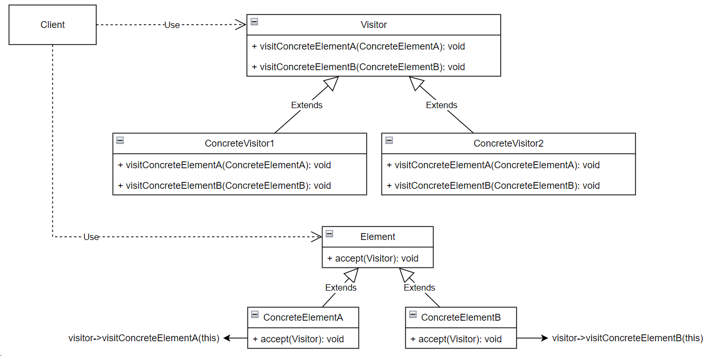

## Visitor (посетитель)

**Тип:** *Поведенческий паттерн*

**Краткое описание:**
Паттерн "Посетитель" описывает операцию, выполняемую с каждым объектом из некоторой структуры.

Для применения паттерна посетитель определяется две иерархии классов:
* иерархия элементов, над которыми выполняется операция
* иерархия "посетителей", описывающих операции, которые выполняются над элементами

Новая операция создается путем добавления подкласса в иерархию классов посетителей.
Добавление новой операции не требует изменений в иерархии классов элементов.

Важным требованием применимости паттерна является "стабильность" иерархии классов элементов. 
При добавлении новых классов элементов, придется переопределять интерфейсы всех посетителей.

"Посетитель" может посещать объекты не имеющие общего родительского класса. В интерфейсе класса Visitor
можно добавить операции для объектов любого типа.
Например, в примере ниже, классы Type1 и Type2 необязательно должны быть связаны отношением наследования от
общего родительского класса.

```
class Visitor {
public:
    void visitType1(Type1*);
    void visitType2(Type2*);
}
```

**Общая схема:**

